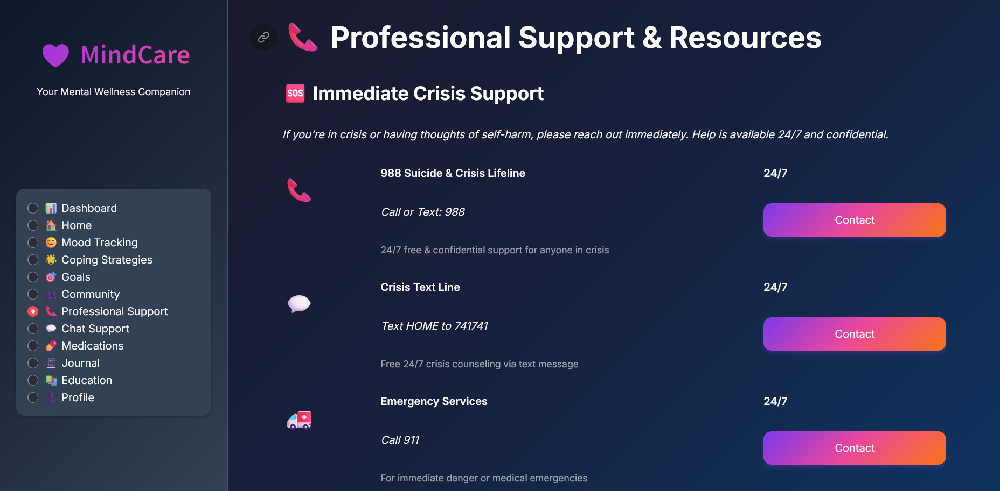

# 💜 MindCare: Women's Wellness Platform

**MindCare** is a holistic health application designed for **Problem Statement 3 (Women's Health)**. It combines mental health tracking with physical wellness monitoring, wrapped in a modern, "Calm-First" dark-mode interface.

---

### 🚀 Quick Links & Project Interface

| **Core Resources** | **Interface Preview** |
| :--- | :--- |
| 🎨 **[Figma Prototype] [([https://fixing-fond-77718326.figma.site/](https://fixing-fond-77718326.figma.site))]** |  |
| 📺 **[Project Demo Video](PASTE_YOUR_PUBLIC_GOOGLE_DRIVE_LINK_HERE)** |  |
| 📁 **[Source Code](#)** (You are here) | *Modern Dark-Purple UI* |

---

### ✨ Key Features
* **Mood Analytics:** 30-day interactive visualization of emotional well-being using Plotly.
* **Women's Health Hub:** Integrated tools for cycle tracking and wellness logs.
* **Emergency SOS:** A high-visibility, one-tap crisis support button for instant safety.
* **Medication Tracker:** Smart scheduling and adherence monitoring for daily health.
* **Resource Library:** Curated articles and videos for mental and physical self-care.

### 🛠️ Tech Stack
* **UI/UX Design:** [Figma](https://www.figma.com/make/LEOyTw8XwG0IDZCPlVvvIC/MindCare-dark-purple-theme?t=eh5f5R8dbytQwJkw-6)
* **Frontend/Backend:** Python & Streamlit
* **Data Visualization:** Plotly Express
* **Styling:** Custom CSS (style.css)

---

### 📦 Quick Setup
1. **Install dependencies:** ```bash
   pip install -r requirements.txt
